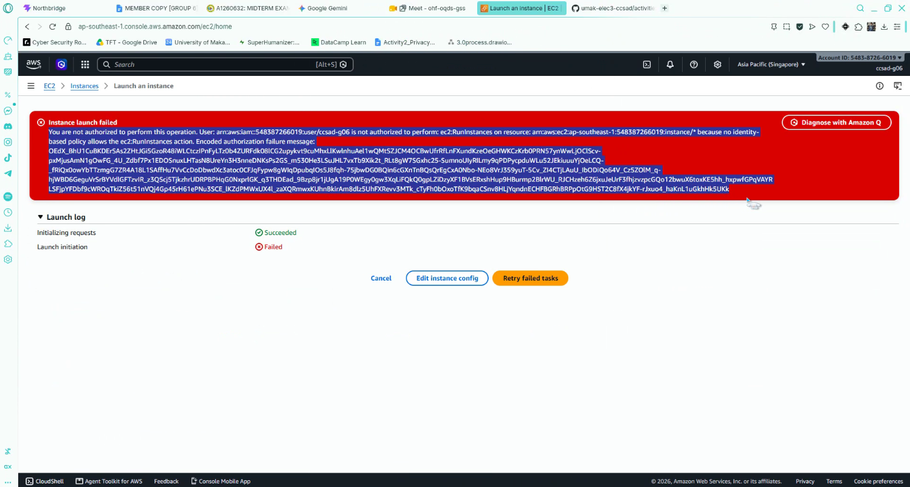
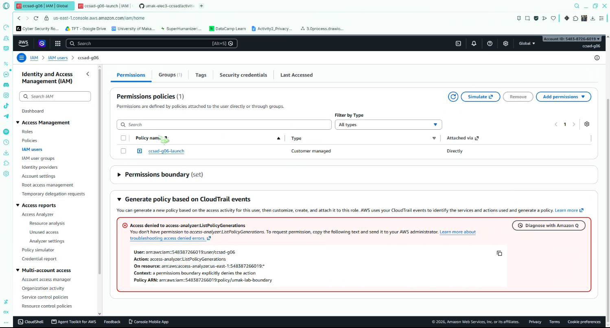
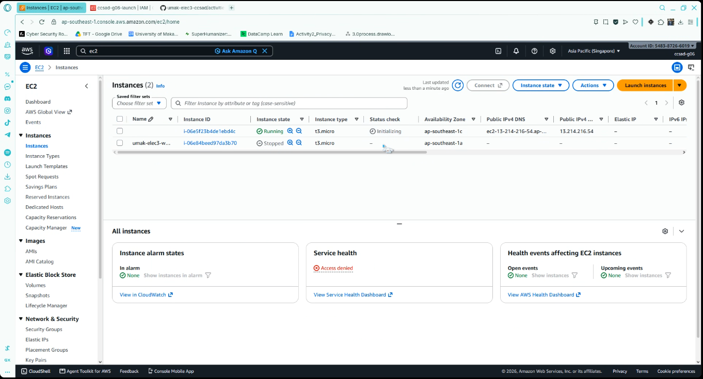
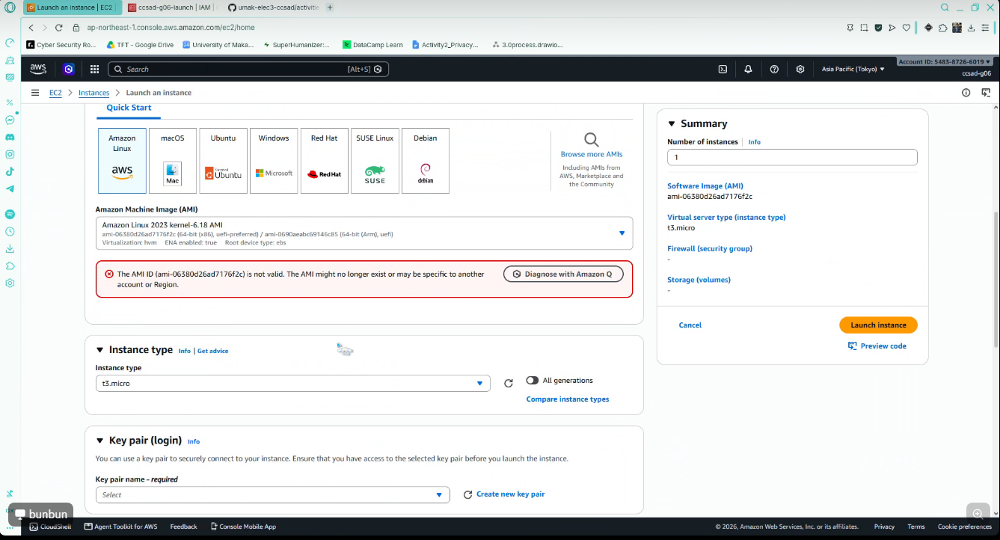
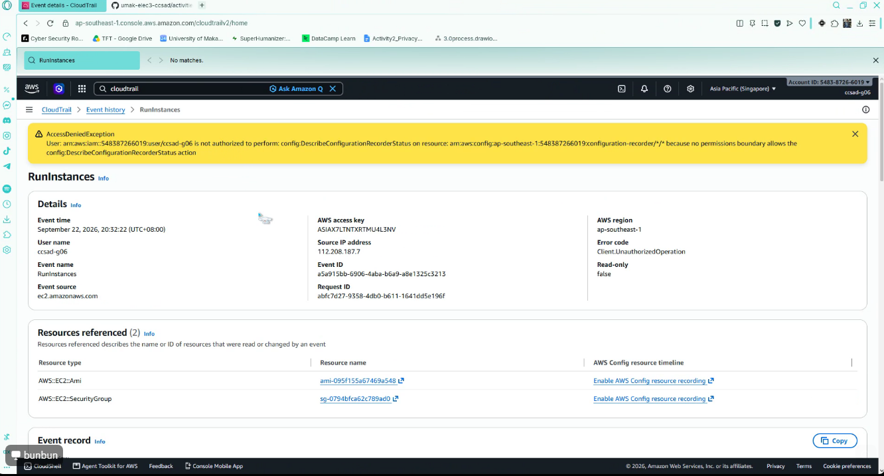

# Lab 1 Submission

## Part B
**Error Action Name:** 
User: arn:aws:iam::548387266019:user/ccsad-g06 is not authorized to perform: ec2:RunInstances on resource: arn:aws:ec2:ap-southeast-1:548387266019:instance/* because no identity-based policy allows the ec2:RunInstances action.

**Screenshot:**

## Part C
**Policy Statement Blanks:**
- `"Action"`: "ec2:RunInstances"
- `"Resource"`: "arn:aws:ec2:ap-southeast-1:548387266019:instance/*"
- `"ec2:InstanceType"`: "t3.micro"

## Part D
**Error Action Name:** 
User: arn:aws:iam::548387266019:user/ccsad-g06 is not authorized to perform: ec2:CreateSecurityGroup on resource: arn:aws:ec2:ap-southeast-1:548387266019:security-group/* because no identity-based policy allows the ec2:CreateSecurityGroup action. 

**Running Instance Time:** 12:24 UTC

**Screenshot 1 (Permissions Tab):**

**Screenshot 2 (Running Instance):**

## Part E
**t3.small / Tokyo Denial Error:** 
User: arn:aws:iam::548387266019:user/ccsad-g06 is not authorized to perform: ec2:DescribeTags with an explicit deny in a permissions boundary: arn:aws:iam::548387266019:policy/umak-lab-boundary

**Screenshot 1 (Boundary Denial):**

**Screenshot 2 (CloudTrail Event):**

## Part F Questions
1. Which action did the Part B error name?
   : It named the action `ec2:ec2:DescribeTags`.
2. In your policy, which condition limits `ec2:RunInstances`?
   The condition that checks if the instance type is exactly `t3.micro`.
3. After you attached `ec2:*` on `*`, why was `t3.small` still denied? Name the boundary statement.
   It was denied because of the `DenyEverythingExceptT2Nano` boundary statement overriding the identity policy.
4. Why is `ec2:*` on `*` a poor policy even with a boundary?
   Because an ec2:* on * policy is dangerous. It grants complete control over your entire EC2 infrastructure, and a permissions boundary only sets a maximum limit. It does not fix or rewrite the unsafe, wide-open access allowed by the policy.
5. In two sentences: what does the boundary control that your policy cannot?
   A permissions boundary controls the absolute maximum permissions an IAM principal can ever possess, effectively acting as an unbypassable safety guardrail. It prevents users or roles—even those with admin access or the ability to attach policies—from expanding their privileges beyond the administrator-defined ceiling.
