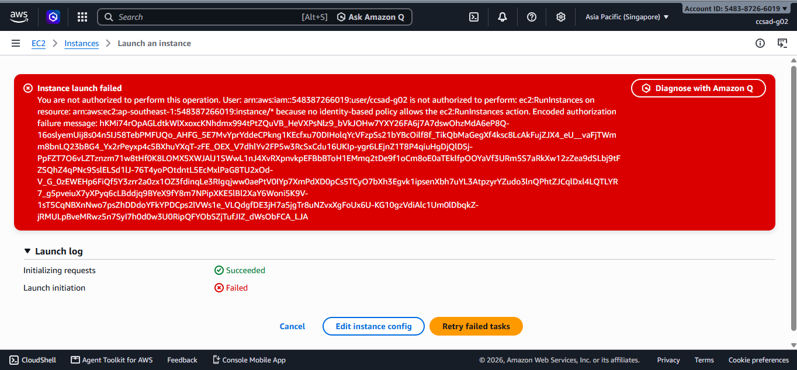
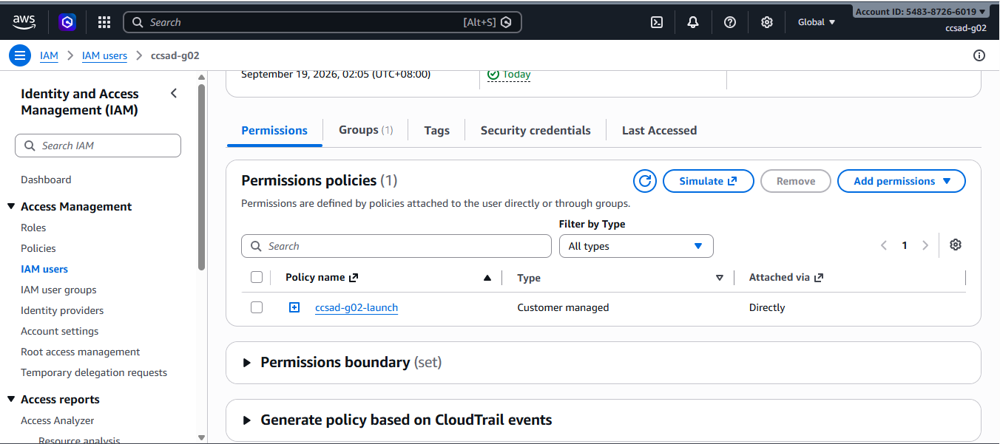
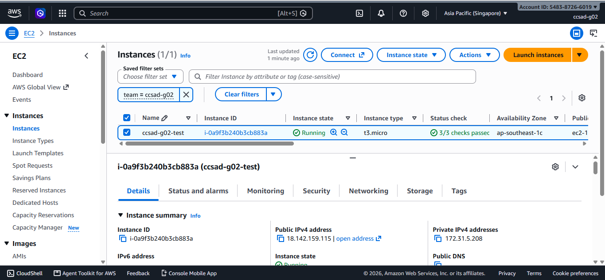
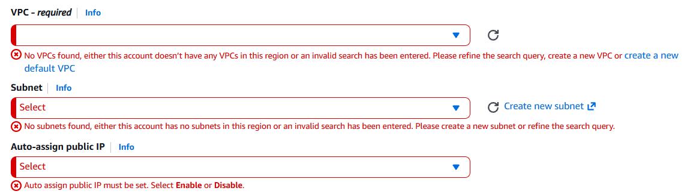
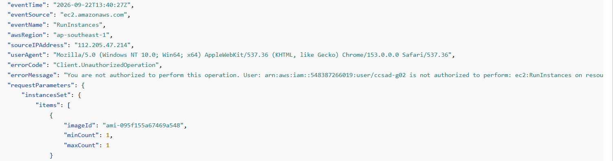

# Lab 1 Submission

## Part B
**Error Action Name:** Instance launch failed
You are not authorized to perform this operation. User: arn:aws:iam::548387266019:user/ccsad-g02 is not authorized to perform: ec2:RunInstances on resource: arn:aws:ec2:ap-southeast-1:548387266019:instance/* because no identity-based policy allows the ec2:RunInstances action. Encoded authorization failure message: hKMi74rOpAGLdtkWlXxoxcKNhdmx994tPtZQuVB_HeVXPsNlz9_bVkJOHw7YXY26FA6j7A7dswOhzMdA6eP8Q-16oslyemUij8s04n5IJ58TebPMFUQo_AHFG_5E7MvYprYddeCPkng1KEcfxu70DIHolqYcVFzpSs21bYBcOilf8f_TikQbMaGegXf4ksc8LcAkFujZJX4_eU__vaFjTWmm8bnLQ23bBG4_Yx2rPeyxp4c5BXhuYXqT-zFE_OEX_V7dhlYv2FP5w3RcSxCdu16UKIp-ygr6LEjnZ1T8P4qiuHgDjQlDSj-PpFZT7O6vLZTznzm71w8tHf0K8LOMX5XWJAlJ1SWwL1nJ4XvRXpnvkpEFBbBToH1EMmq2tDe9f1oCm8oE0aTEklfpOOYaVf3URm5S7aRkXw12zZea9dSLbj9tFZSQhZ4qPNc9SslELSd1lJ-76T4yoPOtdntL5EcMxlPaG8TU2xOd-V_G_0zEWEHp6FiQf5Y3zrr2a0zx1OZ3fdinqLe3RIgqjww0aePtV0IYp7XmPdXD0pCs5TCyO7bXh3Egvk1ipsenXbh7uYL3AtpzyrYZudo3lnQPhtZJCqlDxl4LQTLYR7_g5pveiuX7yXPyq6cLBddjq9BYeX9fY8m7NPipXKE5lBl2XaY6Woni5K9V-1sT5CqNBXnNwo7psZhDDdoYFkYPDCps2lVWs1e_VLQdgfDE3jH7a5jgTr8uNZvxXgFoUx6U-KG10gzVdiAlc1Um0lDbqkZ-jRMULpBveMRwz5n7SyI7h0d0w3U0RipQFYObSZjTufJIZ_dWsObFCA_LJA

**Screenshot (Part B launch denial with username visible):**

## Part C
**Policy Statement Blanks:**
- `"Action"`: ec2:RunInstances
- `"Resource"`: instance
- `"ec2:InstanceType"`: t3.micro

## Part D
**Security Group Error Text:** You are not authorized to perform this operation. User: arn:aws:iam::548387266019:user/ccsad-g02 is not authorized to perform: ec2:CreateSecurityGroup on resource: arn:aws:ec2:ap-southeast-1:548387266019:security-group/* because no identity-based policy allows the ec2:CreateSecurityGroup action. Encoded authorization failure message: jfEdJf7LJx4POQbz9GP1bYoc4yYtOiEehqbhbKZ-OxX39pKzsZk_ukZcqCpJMWsA6W9qMkPKUdgE_7ap6upONyW8sIRiZUv_DYkI-nbtiiWh44PfUPXJDchU0zcXZOEdXq5yWbstWYZNMgQotC2KdwNqL3qL2eWRJfNCuYo4xuN9X_-i_Z_Az6h3_SudTq8o-cCdyA5k5s4gOJYy_PPan8ldgAHjt5ev56AVoq0-cxhVgYMJGksd9QPGprJqm0kJSktNivIt8GPLQn0e35AayIwgDGsKGkcQ6CMSlWrOvCRgDJMpb3Da6Qad28DCERKOPvJDDQIQkEI23TKDRhcCR8krrEieJGXTVUkBloiPaxShKkRaVogdJw4QCkFMVfZSO_WaFACKIlJODHw6SCAMgdJN1ByUVto_uvmsuJLZLqMbL4f5gwfLpbhtbedevJ5Ne4MANPyQjNhgR5o_P7TQy5pwsKCIj1iJj6b_3MaGkLljYXRtls2v4hQgxh7yLXXR58RuyZi4z6YGCIwQljiRWPI17Kz83Ca7Ipf-hdTdYwA7

**Running Instance Time:** 2026/09/22 21:16 GMT+8

**Screenshot 1 (Permissions tab listing <user>-launch):**

**Screenshot 2 (Instance in Running state):**

## Part E
**t3.small / Tokyo Denial Error:** Exception while fetching data (/Resources/EC2_Instances) : software.amazon.awssdk.services.ec2.model.Ec2Exception: You are not authorized to perform this operation. User: arn:aws:iam::548387266019:user/ccsad-g02 is not authorized to perform: ec2:DescribeInstances with an explicit deny in a permissions boundary: arn:aws:iam::548387266019:policy/umak-lab-boundary (Service: Ec2, Status Code: 403, Request ID: a81cb411-6011-45e2-aa38-c9adc2243d73) (SDK Attempt Count: 1)

**Screenshot 1 (t3.small or Tokyo denial):**

**Screenshot 2 (CloudTrail event showing errorMessage):**

## Part F Questions
1. Which action did the Part B error name?
   The Part B error named the action `ec2:RunInstances`.
2. In your policy, which condition limits `ec2:RunInstances`?
   The `StringEquals` condition limits `ec2:RunInstances` by requiring `ec2:InstanceType` to equal `t3.micro`.
3. After you attached `ec2:*` on `*`, why was `t3.small` still denied? Name the boundary statement.
   The `t3.small` instance was still denied because the permissions boundary contains an explicit Deny. The boundary statement is `DenyAnyInstanceTypeButT3Micro`, and an explicit Deny overrides the Allow permission from the `ec2:*` policy.
4. Why is `ec2:*` on `*` a poor policy even with a boundary?
    `ec2:*` on `*` is a poor policy because it grants very broad EC2 permissions and violates the principle of least privilege. Even with a permissions boundary, it may still allow unintended actions that the boundary does not explicitly restrict.
5. In two sentences: what does the boundary control that your policy cannot?
    A permissions boundary sets the maximum permissions that an IAM user can receive. An identity policy can grant permissions only within that boundary and cannot override an explicit Deny.
