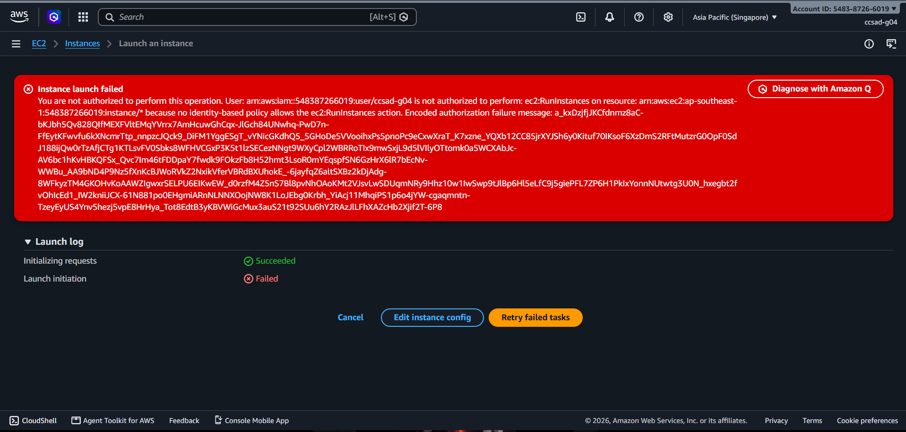
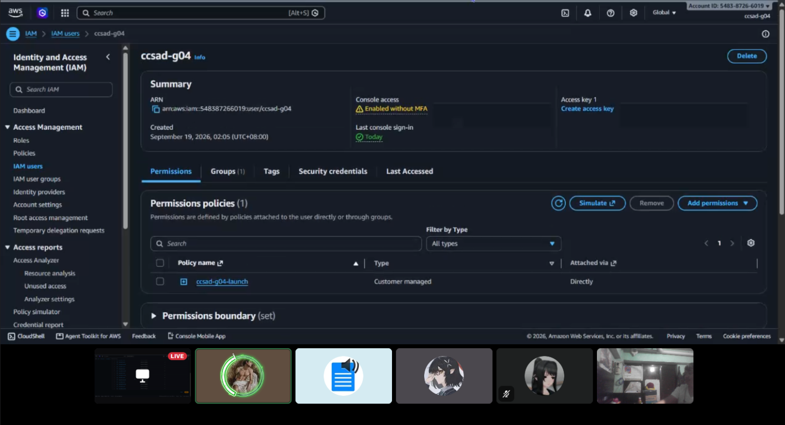
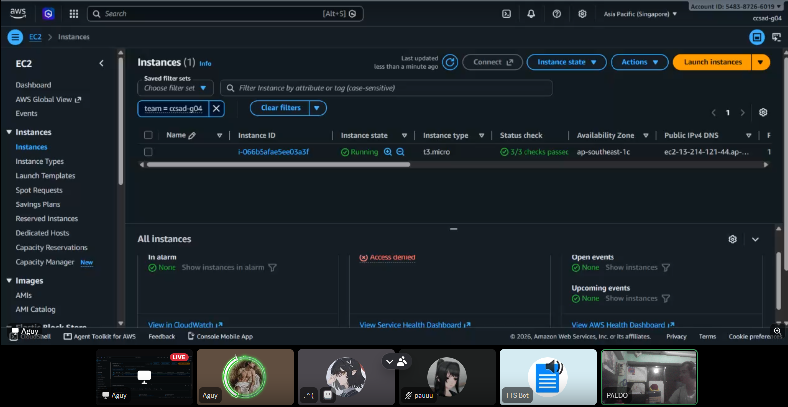
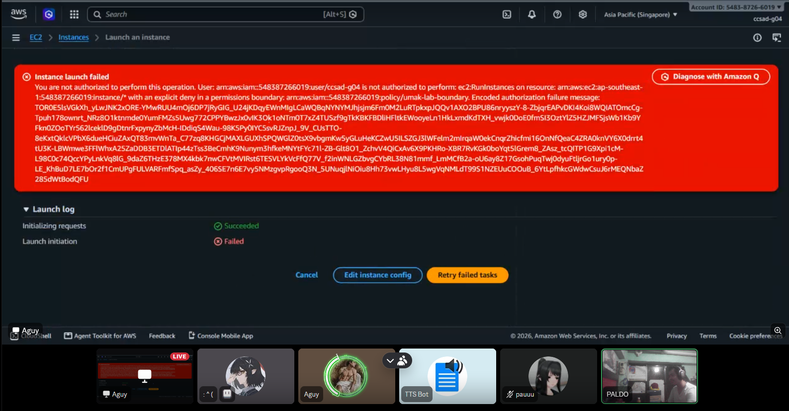
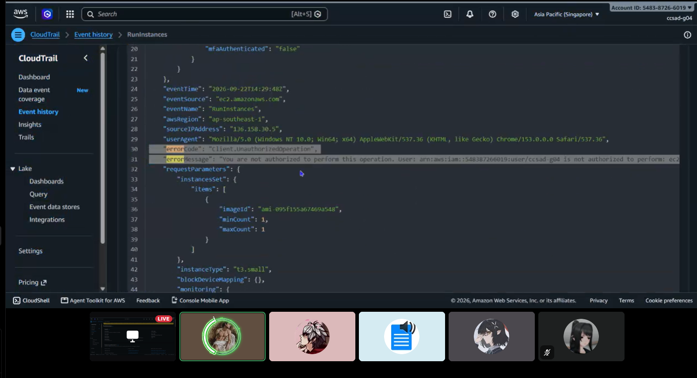

# Lab 1 Submission

## Part B
**First launch attempt error:**

Instance launch failed

You are not authorized to perform this operation. User: arn:aws:iam::548387266019:user/ccsad-g04 is not authorized to perform: **ec2:RunInstances** on resource: arn:aws:ec2:ap-southeast-1:548387266019:instance/* because no identity-based policy allows the ec2:RunInstances action. Encoded authorization failure message: a_kxDzjfjJKCfdnmz8aC-bKJbh5Qv828QIfMEXFVltEMqYVrrx7AmHcuwGhCqx-JlGch84UNwhq-PwD7n-FfEytKFwvfu6kXNcmrTtp_nnpzcJQck9_DiFM1YggESgT_vYNicGKdhQ5_5GHoDe5VVooihxPs5pnoPc9eCxwXraT_K7xzne_YQXb12CC85jrXYJSh6y0Kituf70IKsoF6XzDmS2RFtMutzrG0OpF0SdJ188ijQw0rTzAfjCTg1KTLsvFV0Sbks8WFHVCGxP3K5t1lzSECezNNgt9WXyCpl2WBRRoTIx9mwSxjL9d5lVIlyOTtomk0a5WCXAbJc-AV6bc1hKvHBKQFSx_Qvc7Im46tFDDpaY7fwdk9FOkzFb8H52hmt3LsoR0mYEqspfSN6GzHrX6lR7bEcNv-WWBu_AA9bND4P9Nz5fXnKcBJWoRVkZ2NxikVferVBRdBXUhokE_-6jayfqZ6altSXBz2kDjAdg-8WFkyzTM4GKOHvKoAAWZIgwxrSELPU6EIKwEW_d0rzfM4Z5nS7Bl8pvNhOAoKMt2VJsvLwSDUqmNRy9Hhz10w1IwSwp9tJlBp6Hl5eLfC9j5giePFL7ZP6H1PkIxYonnNUtwtg3U0N_hxegbt2fvOhIcEd1_IW2kniiJCX-61N881po0EHgmiARnNLNNXOojNW8K1LoJEbg0Krbh_YiAcj11MhqiPS1p6o4jYW-cgaqmntn-TzeyEyUS4Ynv5hezj5vpE8HrHya_Tot8EdtB3yKBVWiGcMux3auS21t92SUu6hY2RAzJlLFhXAZcHb2Xjif2T-6P8

## Part C
**Policy Statement Blanks:**
- `"Action"`: `ec2:RunInstances`
- `"Resource"`: `instance` (resulting ARN: `arn:aws:ec2:ap-southeast-1:548387266019:instance/*`)
- `"ec2:InstanceType"`: `t3.micro`

These values follow the `ec2:RunInstances` denial from Part B and the intended `RunOnlyT3MicroInstances` statement in the starter policy.

## Part D
**Security Group Error Text:**

You are not authorized to perform this operation. User: arn:aws:iam::548387266019:user/ccsad-g04 is not authorized to perform: ec2:CreateSecurityGroup on resource: arn:aws:ec2:ap-southeast-1:548387266019:vpc/vpc-02b29ff02cd658307 because no identity-based policy allows the ec2:CreateSecurityGroup action. Encoded authorization failure message: oYEjsDmw9uEJjdOI8ABjYe2RQhYmXNBvqTNwBod5p1qBTRDnOWWu5DLKCY2VyaWr8mE1J47hPILB1ZnLvjJ03jiCgf9KFjLfawdEHO0cxwlPACtalKwGtAV3RwiZ1_-89180Qrf47ULYMWxaz6Nt-ruvU59Q5CE9-Ik7lL08uduMd0miDTNnw0jRwed3Gknu5nCd33HZhFt9VMDIbNJ9ixFJDsxsw_aIJ-rynvHYdex52j6OUtQdw047jozUlkbzdGVkbodj6dLERGAg5Pu7_tlYstB4BKec_kkHra0lwI4ZcTxaSmlY4JgKGTP9w_-1wQh5uImePaQFAeNo5CPwBinKvMUyE1Twh_a4pMtDyqnoYgQP2ip_d4TiBupVqyZZzzJIBapTIzgDNCqHwHm3yKENoSY7tXnCsgxiqP81c4nW51IrK3PP1UIyhQUm7gkUethaxjeTbGcgtSOs0FXE4iF7MXgUiauwwxbtXefE6QQSX2f98J8DjES2bwr4W6cx3_JLsmMw5jTk2e23Gg2XK_Z_RTkMJ7IXMI2Q9TZ8XwFs3lpvzQUSqQXS4lgm5Y5NSVlXv34

**Running Instance Time:** Observed Running on 2026-09-22 at 22:21 PHT (exact transition time was not recorded). Instance ID: `i-066b5afae5ee03a3f`; tag: `team=ccsad-g04`.

**Permissions tab listing `ccsad-g04-launch`:**

**Instance in Running state:**

## Part E
**t3.small denial before attaching the broad policy:**

Instance launch failed

You are not authorized to perform this operation. User: arn:aws:iam::548387266019:user/ccsad-g04 is not authorized to perform: ec2:RunInstances on resource: arn:aws:ec2:ap-southeast-1:548387266019:instance/* with an explicit deny in a permissions boundary: arn:aws:iam::548387266019:policy/umak-lab-boundary. Encoded authorization failure message: TOR0E5lsVGkXh_yLwJNK2xORE-YMwRUU4mOj6DP7jRyGIG_U24jKDqyEWnMIgLCaWQBqNYNYMJhjsjm6Fm0M2LuRTpkxpJQQv1AXO2BPU86nryyszY-8-ZbjqrEAPvDKI4Koi8WQIATOmcCg-Tpuh178ownrt_NRz8O1ktnmde0YumFMZs5Uwg772CPPYBwzJx0vIK3Ok1oNTm0T7xZ4TUSzf9gTkKBKFBDliHFltkEWooyeLn1HkLxmdKdTXH_vwjk0DoE0fmSI3OztYlZ5HZJMFSjsWb1Kb9YFkn0ZOoTYr562lceklD9gDtnrFxpynyZbMcH-IDdiqS4Wau-98K5Py0IYC5svRJZnpJ_9V_CUsTTO-8eKxtQklcVPbX6dueHCiuZAxQT83mvWnTa_C77zq8KHGCjMAXLGUXhSPQWGlZ0tsX9vbgmKw5yGLuHeKCZwU5ILSZGJ3lWFelm2mIrqaW0ekCnqrZhicfmi16OnNfQeaC4ZRA0knVY6X0drrt4tU3K-LBWmwe3FFlWhxA25ZaDDB3ETDlATIp44zTss3BeCmhK9Nunym3hfkeMNYtFYc71l-ZB-Glt8O1_ZchvV4QiCxAv6X9PKHRo-XBR7RvKGk0boYqt5lGrem8_ZAsz_tcQITP1G9Xpi1cM-L98C0c74QccYPyLnkVq8lG_9daZ6THzE378MX4kbk7nwCFVtMVIRst6TESVLYkVcFfQ77V_f2inWNLGZbvgCYbRL38N81mmf_LmMCfB2a-oU6ay8Z17GsohPuqTwj0dyuFtljrGo1ury0p-LE_KhBuD7LE7bOr2f1CmUPgFULVARFmfSpq_asZy_406SE7n6E7vy5NMzgvpRgooQ3N_5UNuqjlNiOiu8Hh73vwLHyu8L5wgVqNMLdT99S1NZEUuCOOuB_6YtLpfhkcGWdwCsuJ6rMEQNbaZ285dWtBodQFU

Instance launch failed

You are not authorized to perform this operation. User: arn:aws:iam::548387266019:user/ccsad-g04 is not authorized to perform: ec2:RunInstances on resource: arn:aws:ec2:ap-southeast-1:548387266019:instance/* with an explicit deny in a permissions boundary: arn:aws:iam::548387266019:policy/umak-lab-boundary. Encoded authorization failure message: z-L_hb2VkhrcMs2GISdiwoDYqFaCtIHZPq7wIh_4kCpfKT_Hr7VSBpteAwElYmEdbGgFWLpRlWJKwd2cJcaYZD5F0hYq1hKGa--8X3_NkHWHk81r3QuzwRKOaGzY0BB4N5bXEtADukkCbWKpqZ-ogCti4nnrTDlFcZwaRfpeXQts4nJcmikn5mROGsYjoaaJLWYVPzfCE-r5ZmmA0QBtwiNgUU0Lrn0fCKB8PlprQVVpj8e3rIOWwNSpA0pPnNkxV-KlKSKlenphXeJ5fdGT5mQJG97-kC_y9czVPzQt1qpBXwAdCnufjGe79W21PQ84CJTexNOsCw9lJHJoG0fRWwiyhQv-mvxzhqKUOL2WsV_507rqAXBaEjbJPsX1oQS3dotYSxuoDLbBIe_zXgD6U_Z9Aaq-KhZ5c54IN0WQorreUPpwSAHMZFxUtKoYQCkRYNdNLysscY0VtlhRAtQrs6VJ7qASg6h-rNh94CkNOQ3t4zPonMcH6jvwXftdaEHJ6gOCZsYoRZmy0f-2Jvmg8tiPt_sn9Ae8E-0YNqX7gS_IX9RA1--DEK9AC50xs2u32-LHucOUKTvA7ByLuAt701UM2-II4MjIAgpd5yn8MGA0vc_UFRWbFZh8bp1f10aPpuSJzEcaJzb8Y5HHao2k-rP0UW1KrFIQvyk_9DbT4Zhr81VwFf_BGh4syf8TB_JtQxNyjHOcXdCsTlS4TS_nlPTgJbg_3Wy8EYfN52zW295N0cMUFC6DG9QBjhhOgReFJhyeSi6pz_hAXoLNfvTO6iqte3KkPV9fgm-m145i6UAZieCDw_upj3SGs2lGdgqQQ0B7mWqQ6qpguIzIMLkiNk_kSbUF5LmnrlRIIjFDbdyt9Y78qU25QBX6i1MkusRdstCFK5nfGbtOTGZJdNwlJtGCLg4-flcydyQ1LjTX411PxGPjJ28b3DOT5GCYXLM

**Tokyo AMI selector error:** The AMI ID (ami-06380d26ad7176f2c) is not valid. The AMI might no longer exist or may be specific to another account or Region.

**Tokyo VPC selector error:** You are not authorized to perform this operation. User: arn:aws:iam::548387266019:user/ccsad-g04 is not authorized to perform: ec2:DescribeVpcs with an explicit deny in a permissions boundary: arn:aws:iam::548387266019:policy/umak-lab-boundary.

**CloudTrail `RunInstances` event:** `errorCode` was `Client.UnauthorizedOperation`. The `errorMessage` said: "You are not authorized to perform this operation. User: arn:aws:iam::548387266019:user/ccsad-g04 is not authorized to perform: ec2:RunInstances on resource: arn:aws:ec2:ap-southeast-1:548387266019:instance/* with an explicit deny in a permissions boundary: arn:aws:iam::548387266019:policy/umak-lab-boundary." The copied message's encoded authorization failure text was truncated.

## Part F Questions
1. Which action did the Part B error name?
   Our Part B error named `ec2:RunInstances`.

2. In your policy, which condition limits `ec2:RunInstances`?
   The `RunOnlyT3MicroInstances` statement uses `StringEquals` on `ec2:InstanceType` with the value `t3.micro`.

3. After you attached `ec2:*` on `*`, why was `t3.small` still denied? Name the boundary statement.
   The permissions boundary explicitly denied the launch through `DenyAnyInstanceTypeButT3Micro`. The broad identity policy could not override that deny.

4. Why is `ec2:*` on `*` a poor policy even with a boundary?
   It grants every EC2 action on every resource wherever the boundary permits it, including actions unrelated to this lab. That violates least privilege and could allow unintended changes if the boundary permits more than this task needs.

5. In two sentences: what does the boundary control that your policy cannot?
   The permissions boundary sets the maximum permissions for our IAM user, including the lab's instance-type and Region restrictions. Our identity policy grants permissions only within that limit and cannot override an explicit deny in the boundary.
