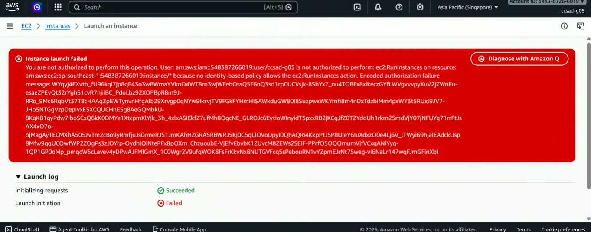
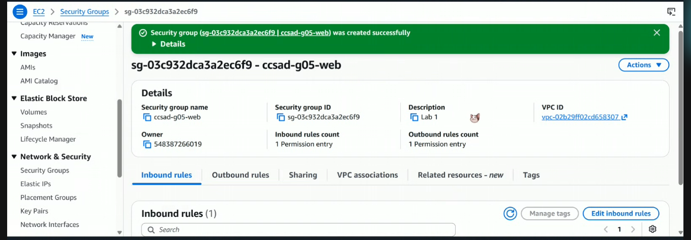
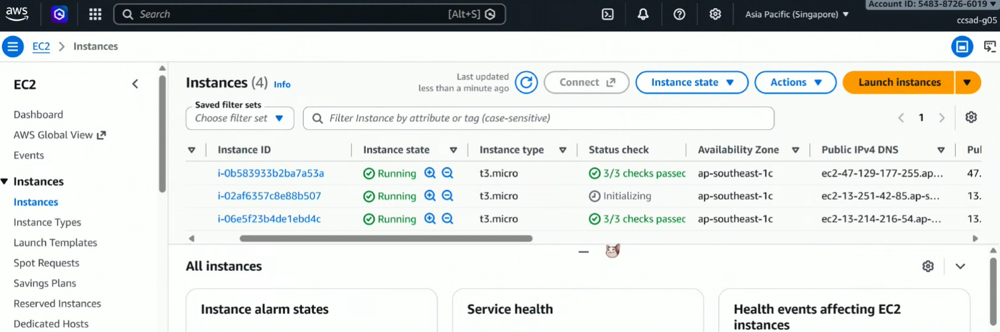
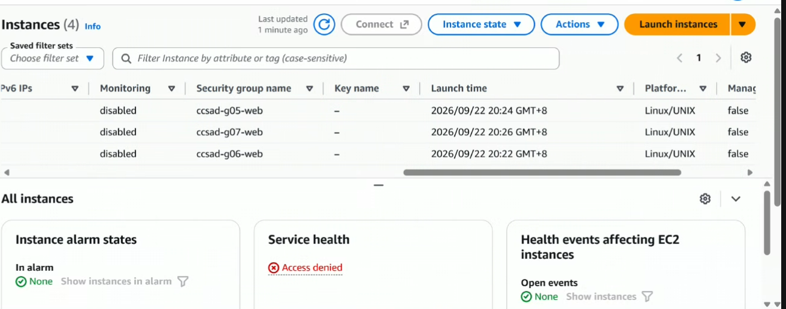
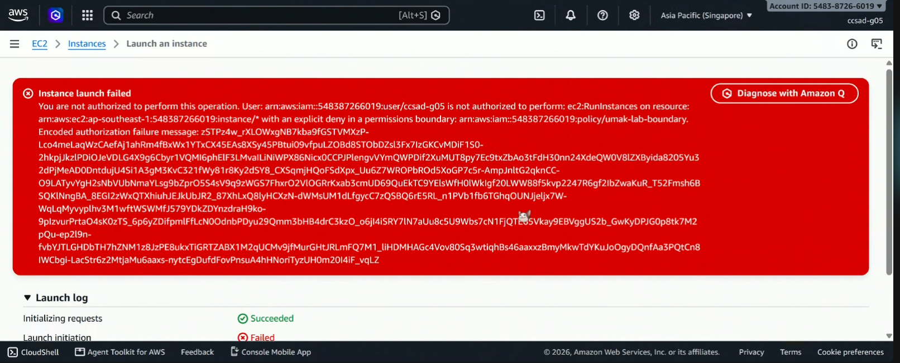
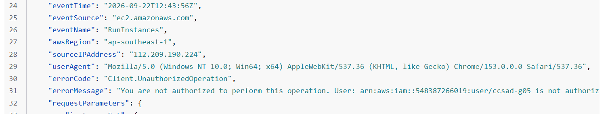

# Lab 1 Submission

## Part B

**Error Action Names:**
You are not authorized to perform this operation. User: arn:aws:iam::548387266019:user/ccsad-g05 is not authorized to perform: **ec2:RunInstances** on resource: arn:aws:ec2:ap-southeast-1:548387266019:instance/\* because no identity-based policy allows the ec2:RunInstances action.

**Screenshot:**

## Part C

Policy Statement Blanks

- `"Action"`: "ec2:FakeActionName"  
- `"Resource"`: "arn:aws:ec2”ap-southeast-1:548387266019:instance/\*"  
- `"ec2:InstanceType"`: "t3.micro"

## Part D

**Security Group Error Text:** 
You are not authorized to perform this operation. User: arn:aws:iam::548387266019:user/ccsad-g05 is not authorized to perform: ec2:CreateSecurityGroup on resource: arn:aws:ec2:ap-southeast-1:548387266019:security-group/\* because no identity-based policy allows the ec2:CreateSecurityGroup action.

**Running Instance Time:** 20:24 GMT+8  

**Screenshot 1 (Permissions Tab):**  

**Screenshot 2 (Running Instance):**  

## Part E

**t3.small / Tokyo Denial Error:** 
Instance Launch failed … You are not authorized to perform this operation. User: arn:aws:iam::548387266019:user/ccsad-g05 is not authorized to perform: ec2:RunInstances on resource: arn:aws:ec2:ap-southeast-1:548387266019:instance/\* with an explicit deny in a permissions boundary.

Screenshot 1 (Boundary Denial):   

Screenshot 2 (CloudTrail Event):  

## Part F

1. Which action did the Part B error name?

    Its name is `ec2.RunInstances error` 

2. In your policy, which condition limits ec2:RunInstances?

    The condition that checks if the instance type is exactly `t3.micro`

3. After you attached ec2:\* on \*, why was t3.small still denied? Name the boundary statement.

    It was denied because of the `RunOnlyT3MicroInstances` boundary statement overriding the identity policy.

4. Why is ec2:\* on \* a poor policy even with a boundary?

    It's a poor practice because the permission boundary limits what the user can do, but it can’t fix the over-privileged policy.

5. In two sentences: what does the boundary control that your policy cannot?

    The boundary of umak-lab-boundary sets the maximum permissions, so even if you try to override it using your own policies, it won’t work since the boundary sets the permission for the account. An identity policy can only grant permissions that don’t exceed the boundary control. 
