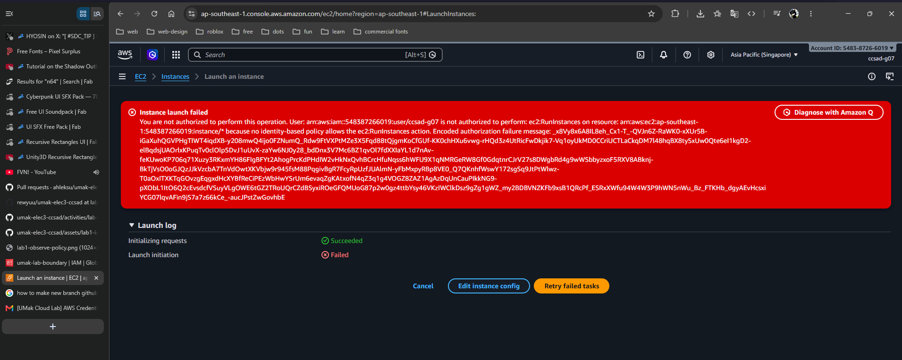
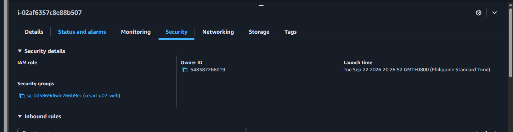
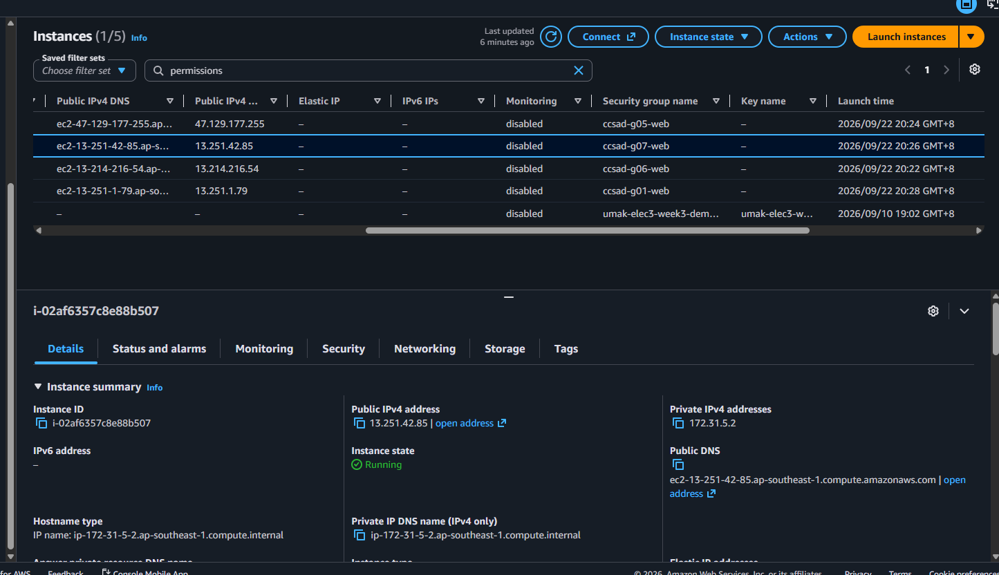
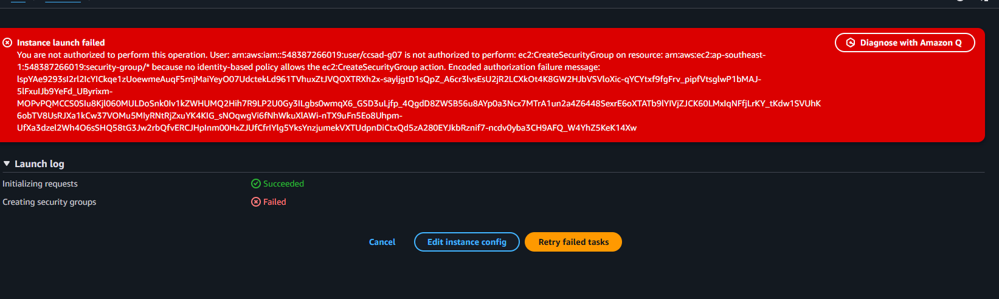
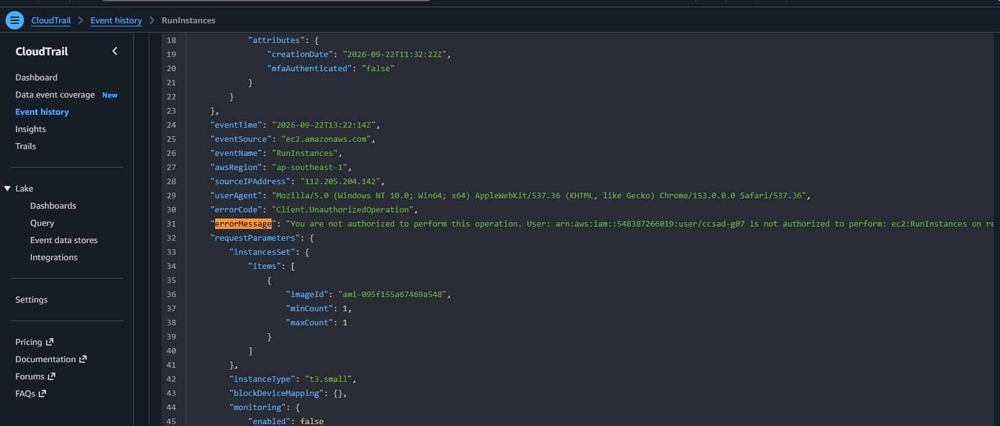

# Lab 1 Submission - GROUP 7

## Part B
**Error Action Name:** 
Instance launch failed. You are not authorized to perform this operation. User: arn:aws:iam::548387266019:user/ccsad-g07 is not authorized to perform: ec2:RunInstances on resource: arn:aws:ec2:ap-southeast-1:548387266019:instance/* because no identity-based policy allows the ec2:RunInstances action.

**Screenshot:**

## Part C
**Policy Statement Blanks:**
- `"Action"`: "ec2:RunInstances"
- `"Resource"`: "arn:aws:ec2:ap-southeast-1:548387266019:instance/*"
- `"ec2:InstanceType"`: "t3.micro"

## Part D
**Security Group Error Text:** 
You are not authorized to perform this operation. User: arn:aws:iam::548387266019:user/ccsad-g07 is not authorized to perform: ec2:CreateSecurityGroup on resource: arn:aws:ec2:ap-southeast-1:548387266019:security-group/* because no identity-based policy allows the ec2:CreateSecurityGroup action.

**Running Instance Time:** 20:26 UTC+8

**Screenshot 1 (Permissions Tab):**

**Screenshot 2 (Running Instance):**

## Part E
**t3.small / Tokyo Denial Error:** 
Exception while fetching data (/Resources/EC2_Instances) : software.amazon.awssdk.services.ec2.model.Ec2Exception: You are not authorized to perform this operation. User: arn:aws:iam::548387266019:user/ccsad-g07 is not authorized to perform: ec2:DescribeInstances with an explicit deny in a permissions boundary: arn:aws:iam::548387266019:policy/umak-lab-boundary (Service: Ec2, Status Code: 403, Request ID: 0121b611-f3c2-474b-9475-6ce61086b487) (SDK Attempt Count: 1)

**Screenshot 1 (Boundary Denial):**

**Screenshot 2 (CloudTrail Event):**

## Part F Questions
1. Which action did the Part B error name?
   - It named the action `ec2:RunInstances`.
2. In your policy, which condition limits `ec2:RunInstances`?
   - The StringEquals condition checking if ec2:InstanceType is set to `t3.micro`.
3. After you attached `ec2:*` on `*`, why was `t3.small` still denied? Name the boundary statement.
   - It was denied because of the `umak-lab-boundary` policy contains an explicit deny statement for non-t3.micro instances that overrides the allow policy.
4. Why is `ec2:*` on `*` a poor policy even with a boundary?
   - It violates the principle of least privilege by granting destructive or unintended EC2 permissions that the boundary does not explicitly block.
5. In two sentences: what does the boundary control that your policy cannot?
   - A permissions boundary enforces an absolute maximum limit on the actions an IAM identity is permitted to execute across the account. An identity policy can only request permissions up to that boundary cap, but can never exceed or grant access past it.
