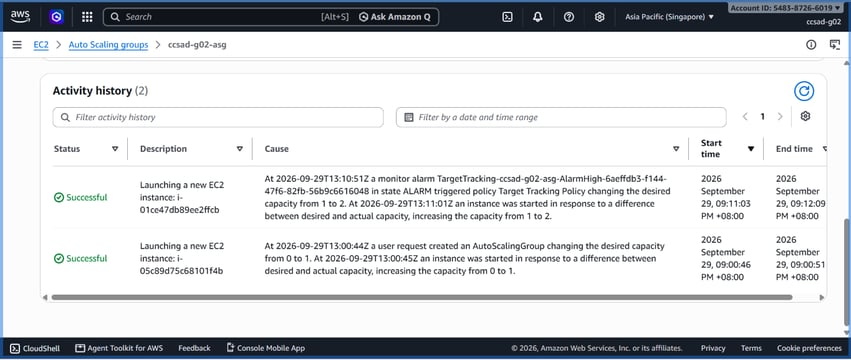
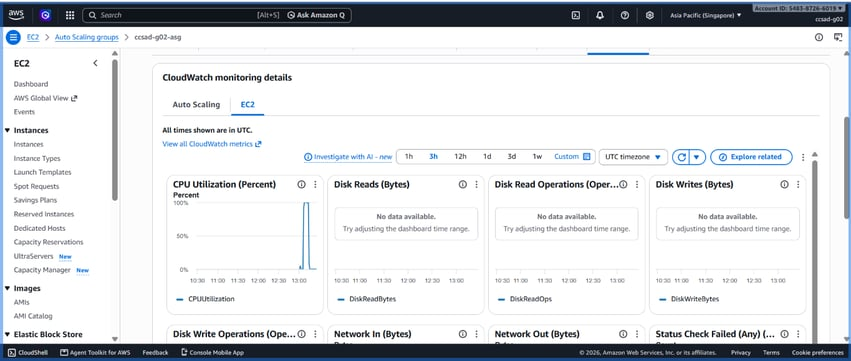

# Lab 2 Submission

## Instance Tracking
**First Instance**
- Instance ID: i-05c89d75c68101f4b
- Availability Zone: ap-southeast-1a

**Second Instance**
- Instance ID: i-01ce47db89ee2ffcb
- Availability Zone: ap-southeast-1b

## Proof (Screenshots)
1. **Activity History:** Add a screenshot showing the Auto Scaling group's Activity history when the second instance launched.
   
  

2. **CloudWatch Alarm:** Add a screenshot of the target tracking alarm in the "In alarm" state.

  

## Questions
1. Why did the group stop at 2 instances?
   The Auto Scaling group reached its configured maximum capacity limit of 2 instances.
2. Why did terminating an instance by hand not remove the cost?
    The Auto Scaling group automatically launched a new instance to replace the terminated one and maintain its configured capacity.
3. Why is the target value set to your assigned value (e.g., 30-85 percent) instead of 99 percent?
   Lower target values leave a safety buffer for sudden traffic spikes while new instances launch. Setting it to 99 percent risks server slowdowns and crashes before scaling occurs.
4. What did the automatic cutoff protect us from?
   It protected against runaway cloud computing costs and excessive resource consumption.
5. What changes when a load balancer sits in front of the group?
   It evenly distributes incoming traffic across all active instances and provides a single public access point.
