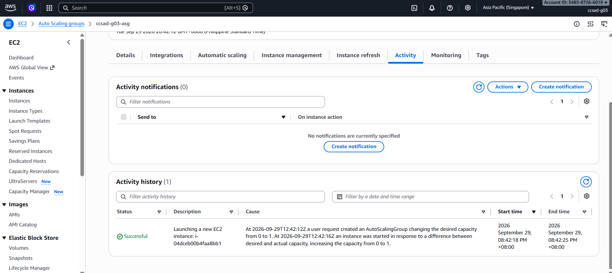
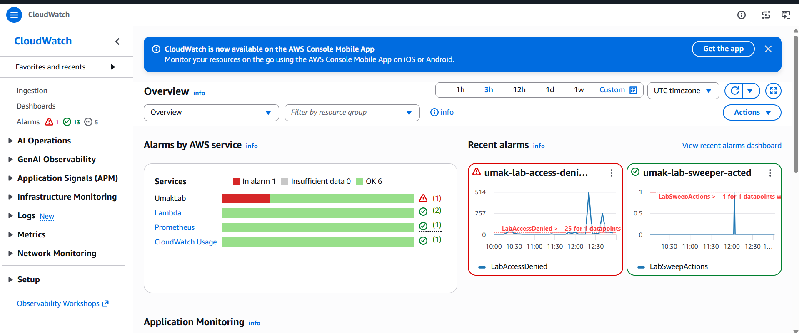

# Lab 2 Submission

## Instance Tracking
**First Instance**
- Instance ID:  i-04dceb00b4faa8bb1
- Availability Zone: ap-southeast-1b

**Second Instance**
- Instance ID: i-0faf7d7c0f3039a53
- Availability Zone: ap-southeast-1a

## Proof (Screenshots)
1. **Activity History:** Add a screenshot showing the Auto Scaling group's Activity history when the second instance launched.

2. **CloudWatch Alarm:** Add a screenshot of the target tracking alarm in the "In alarm" state.

## Questions
1. Why did the group stop at 2 instances?
   The group stopped at 2 instances because its maximum capacity was set to 2. Once the second instance launched, the group had reached its configured limit. A third instance would only launch if the maximum capacity were increased.

2. Why did terminating an instance by hand not remove the cost?
  Manually terminating an instance did not reduce the group’s running capacity because the Auto Scaling group automatically replaced it. The group maintains the configured number of instances, so it launched another instance after detecting the termination. As a result, resource usage and related costs continued.

3. Why is the target value set to your assigned value (e.g., 30-85 percent) instead of 99 percent?
  Our assigned CPU target value is 40 percent, so scaling can happen before the instance becomes heavily utilized. If the target were set to 99 percent, the group would wait until CPU usage was almost at full capacity before responding. A 40 percent target allows another instance to launch earlier and helps distribute the workload.

4. What did the automatic cutoff protect us from?
    The automatic cutoff prevents resources from continuing to run when they are no longer needed. Without it, instances could remain active longer than necessary and continue consuming AWS resources. This helps avoid unnecessary usage and additional charges.

5. What changes when a load balancer sits in front of the group?
    Without a load balancer, each instance is accessed directly through its own public IP address. With a load balancer, users connect through a single endpoint, and incoming requests are distributed across the available instances. The load balancer can also direct traffic toward healthy instances instead of requiring users to connect to each instance individually.