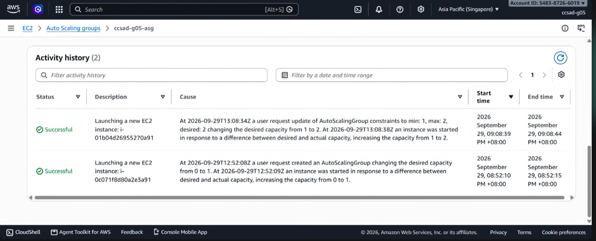
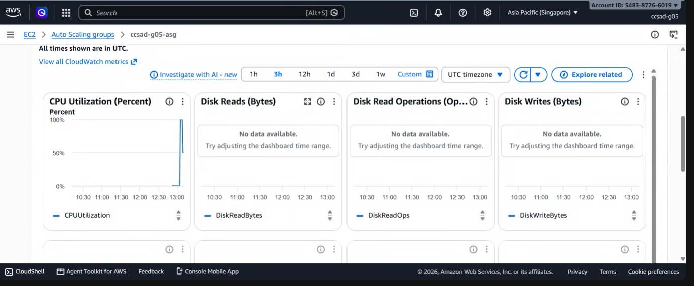

# Lab 2 Submission

## Instance Tracking

## **First Instance**

- Instance ID: i-01b04d2695527oa91  
- Availability Zone: ap-southeast-1a

## **Second Instance**

- Instance ID: i-0c071f8d80a2ae3a91  
- Availability Zone: ap-southeast-1b

# **Proof (Screenshots)**

1. **Activity History:** Add a screenshot showing the Auto Scaling group's Activity history when the second instance launched.

  

2. **CloudWatch Alarm:** Add a screenshot of the target tracking alarm in the "In alarm" state.

# **Questions**

1. Why did the group stop at 2 instances?  
    Because the maximum capacity limit has been configured to only 2 instances by us which prevents the Auto-Scaling group from scaling beyond this limit to reduce costs. If the CPU utilization moves past the threshold, the scaling engine is hard-coded to honor this boundary which helps prevent runaway scaling which happens when unintended servers continue to launch and can lead to high costs in your cloud bill.  
2. Why did terminating an instance by hand not remove the cost?  
    Because the service automatically maintains the required capacity by immediately replacing a deleted instance with a new one to keep the resource count complete. Because the old one was deleted and a new one was created simultaneously, the total active instance count and the ongoing cost remained unchanged.   
3. Why is the target value set to your assigned value (e.g., 30-85 percent) instead of 99 percent?  
    The reason why the target value is set as 30-85 percent is to prevent the existing servers from crashing due to overload before a new instance could finish booting up and passing its health check. By setting a lower target value, this will provide a necessary safety buffer for the system and its servers.  
4. What did the automatic cutoff protect us from?  
    The automatic cutoff saves us from costs and resource exhaustion as well as instance churning which helps prevent unexpected financial charges and protects a system’s account budget from billing shocks.   
5. What changes when a load balancer sits in front of the group?  
    Instead of forcing users to memorize or manually type changing IP addresses of individual instances, a load balancer can provide a stable and unified DNS name. It distributes incoming requests across all healthy instances in the group. If one instance fails or is terminated, the load balancer automatically routes traffic away from it to ensure zero downtime for the end user of the system. 
