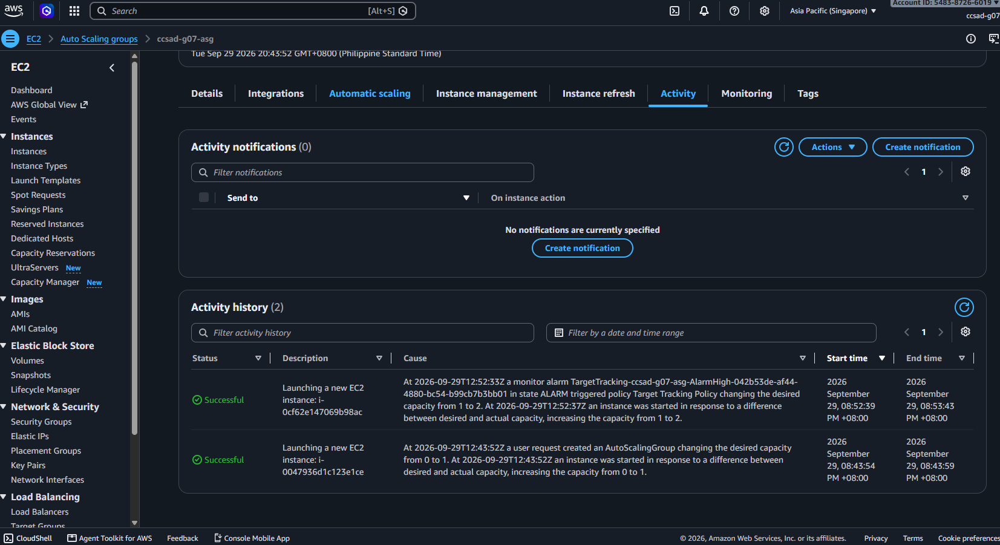
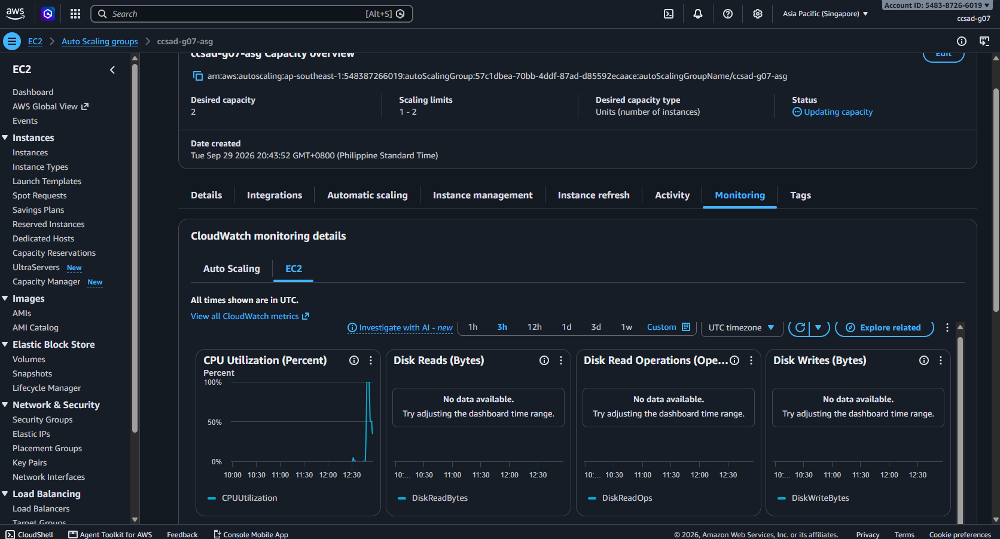

# Lab 2 Submission

## Instance Tracking
**First Instance**
- Instance ID: i-0047936d1c123e1ce
- Availability Zone: ap-southeast-1b

**Second Instance**
- Instance ID: i-0cf62e147069b98ac
- Availability Zone: ap-southeast-1a

## Proof (Screenshots)
1. **Activity History:** Add a screenshot showing the Auto Scaling group's Activity history when the second instance launched.
   
   

2. **CloudWatch Alarm:** Add a screenshot of the target tracking alarm in the "In alarm" state.

   

## Questions
1. Why did the group stop at 2 instances?
   - The Auto Scaling group stopped expanding because its Maximum capacity parameter was explicitly configured to 2 during setup. Regardless of how high CPU usage spiked, the group strictly obeys this cap to prevent uncontrolled resource growth.
2. Why did terminating an instance by hand not remove the cost?
   - Manually terminating an instance caused the group to drop below its configured Desired capacity of 2 instances. To maintain its target state, the Auto Scaling group immediately launched a replacement instance, keeping active compute resources running.
3. Why is the target value set to your assigned value (e.g., 30-85 percent) instead of 99 percent?
   - A lower threshold provides a safety buffer so the group can launch and warm up new instances before existing servers become completely overwhelmed. Setting it at 99% would cause severe performance degradation and high latency while waiting several minutes for a new server to boot.
4. What did the automatic cutoff protect us from?
   - The automatic cutoff served as a cost guardrail against unexpected AWS charges caused by lab resources running indefinitely. It protected the AWS account from budget overruns by automatically decommissioning instances if manual cleanup was forgotten.
5. What changes when a load balancer sits in front of the group?
   - An Application Load Balancer provides a single, fixed access URL that automatically distributes traffic across all healthy scaled instances without requiring users to type individual public IPs. It also enables HTTP-level health checks, allowing the load balancer to route traffic away from unhealthy servers while Auto Scaling replaces them.
