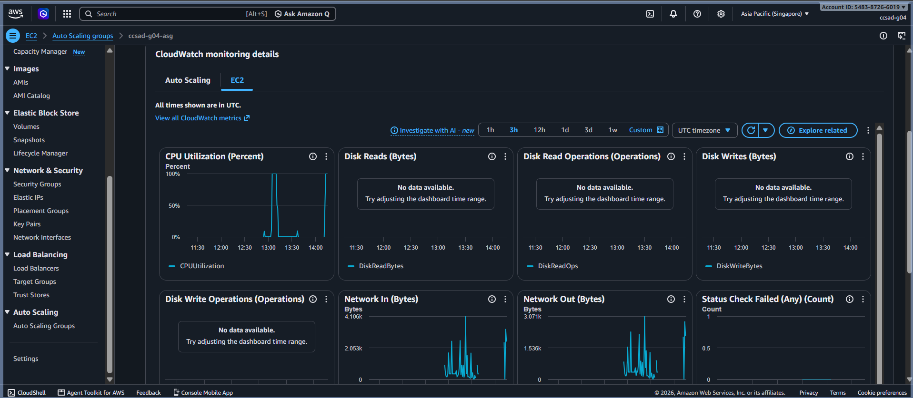

# Lab 2 Submission

## Instance Tracking
**First Instance**
- Instance ID: i-06c253b32e0953040
- Availability Zone: ap-southeast-1a

**Second Instance**
- Instance ID: i-0abb30f4d8ef822ef
- Availability Zone: ap-southeast-1b

## Proof (Screenshots)
1. **Activity History:** Attach the screenshot showing the Auto Scaling group's Activity History when the second instance launched.

   

2. **CloudWatch Alarm:** Attach the screenshot of the target tracking alarm in the "In alarm" state.

   

## Questions
1. Why did the group stop at 2 instances?
   The Auto Scaling group was configured with a minimum capacity of 1 and a maximum capacity of 2. Once it reached the maximum limit, it stopped scaling out even if CPU usage continued to increase.

2. Why did terminating an instance by hand not remove the cost?
   Auto Scaling automatically tries to maintain the desired capacity. When an instance is manually terminated, the group detects the drop in capacity and launches a replacement instance immediately, so charges continue.

3. Why is the target value set to your assigned value (for example, 30-85 percent) instead of 99 percent?
   The target value is intentionally set lower so scaling happens before the instance becomes overloaded. A target of 99% would be too high and could lead to poor performance or instability before a new instance is created. For Group 4, the target is 45%.

4. What did the automatic cutoff protect us from?
   The automatic cutoff protected us from unnecessary AWS charges if we forgot to delete the Auto Scaling resources before the lab ended. It helped prevent costs from continuing to accumulate while the instances and scaling components were still running.

5. What changes when a load balancer sits in front of the group?
   A load balancer gives the Auto Scaling group a single public entry point, distributes traffic across healthy instances, performs health checks, and improves availability and reliability by routing requests away from unhealthy instances.

