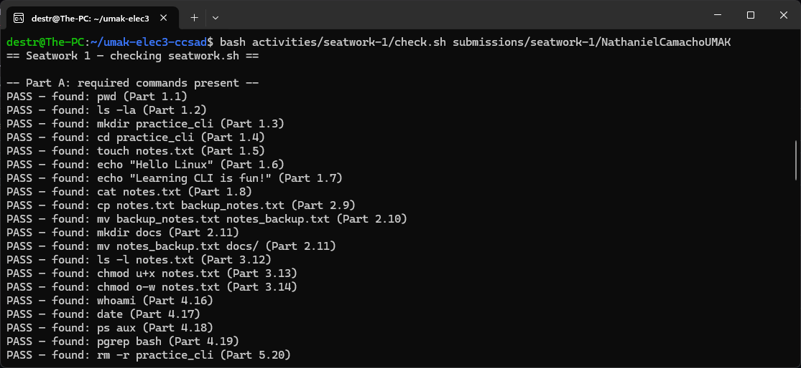
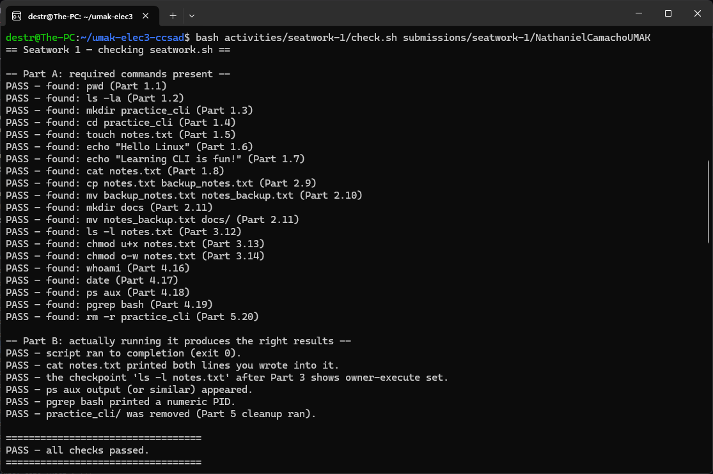

## Activity ID: seatwork-1
## Course: ELEC3 Cloud Computing (CCSAD)  
## Student: Roberto Nathaniel Camacho M, III  

## Screenshots


## Evidence
`check.sh` output showing `PASS`:


```
-- Part A: required commands present --
PASS — found: pwd (Part 1.1)
PASS — found: ls -la (Part 1.2)
PASS — found: mkdir practice_cli (Part 1.3)
PASS — found: cd practice_cli (Part 1.4)
PASS — found: touch notes.txt (Part 1.5)
PASS — found: echo "Hello Linux" (Part 1.6)
PASS — found: echo "Learning CLI is fun!" (Part 1.7)
PASS — found: cat notes.txt (Part 1.8)
PASS — found: cp notes.txt backup_notes.txt (Part 2.9)
PASS — found: mv backup_notes.txt notes_backup.txt (Part 2.10)
PASS — found: mkdir docs (Part 2.11)
PASS — found: mv notes_backup.txt docs/ (Part 2.11)
PASS — found: ls -l notes.txt (Part 3.12)
PASS — found: chmod u+x notes.txt (Part 3.13)
PASS — found: chmod o-w notes.txt (Part 3.14)
PASS — found: whoami (Part 4.16)
PASS — found: date (Part 4.17)
PASS — found: ps aux (Part 4.18)
PASS — found: pgrep bash (Part 4.19)
PASS — found: rm -r practice_cli (Part 5.20)

-- Part B: actually running it produces the right results --
PASS — script ran to completion (exit 0).
PASS — cat notes.txt printed both lines you wrote into it.
PASS — the checkpoint 'ls -l notes.txt' after Part 3 shows owner-execute set.
PASS — ps aux output (or similar) appeared.
PASS — pgrep bash printed a numeric PID.
PASS — practice_cli/ was removed (Part 5 cleanup ran).
```

## Overview
This directory contains the submission for Seatwork 1, which demonstrates fundamental Linux Command Line Interface (CLI) skills. The automated script (`seatwork.sh`) performs a sequence of 20 tasks covering file navigation, directory management, permissions formatting, and system process tracking.

## Contents
The script executes the following operations in a sequential workflow:
* Part 1 — Navigation & File Operations: Basic directory traversal (`pwd`, `cd`), file creation (`touch`), and text output/appending (`echo`, `cat`).
* Part 2 — File & Directory Management: Copying (`cp`), moving/renaming (`mv`), and structuring directories (`mkdir`).
* Part 3 — Permissions: Modifying user and group privileges using `chmod` (e.g., granting execute permissions, removing write permissions).
* Part 4 — Process & System Info: Retrieving current user details (`whoami`), system time (`date`), and tracking process IDs (`ps aux`, `pgrep`).
* Part 5 — Cleanup: Safely removing temporary practice directories (`rm -r`).
