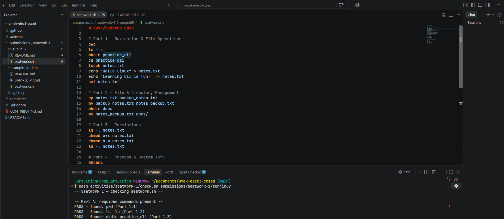

## Activity

Activity ID  `seatwork-1`
Brief used (Lab Activity 1 only): N/A

## Screenshots

Attach 1 or 2 screenshots of you (and your group) actually doing the work in your terminal:



## Evidence

Paste your `check.sh` output showing `PASS`:

```
== Seatwork 1 — checking seatwork.sh ==

-- Part A: required commands present --
PASS — found: pwd (Part 1.1)
PASS — found: ls -la (Part 1.2)
PASS — found: mkdir practice_cli (Part 1.3)
PASS — found: cd practice_cli (Part 1.4)
PASS — found: touch notes.txt (Part 1.5)
PASS — found: echo "Hello Linux" (Part 1.6)
PASS — found: echo "Learning CLI is fun!" (Part 1.7)
PASS — found: cat notes.txt (Part 1.8)
PASS — found: cp notes.txt backup_notes.txt (Part 2.9)
PASS — found: mv backup_notes.txt notes_backup.txt (Part 2.10)
PASS — found: mkdir docs (Part 2.11)
PASS — found: mv notes_backup.txt docs/ (Part 2.11)
PASS — found: ls -l notes.txt (Part 3.12)
PASS — found: chmod u+x notes.txt (Part 3.13)
PASS — found: chmod o-w notes.txt (Part 3.14)
PASS — found: whoami (Part 4.16)
PASS — found: date (Part 4.17)
PASS — found: ps aux (Part 4.18)
PASS — found: pgrep bash (Part 4.19)
PASS — found: rm -r practice_cli (Part 5.20)

-- Part B: actually running it produces the right results --
PASS — script ran to completion (exit 0).
PASS — cat notes.txt printed both lines you wrote into it.
FAIL — couldn't confirm chmod u+x took effect from the checkpoint ls -l output.
  - Make sure Part 3's checkpoint (ls -l notes.txt, after both chmod commands) runs and prints.
PASS — ps aux output (or similar) appeared.
FAIL — no bare numeric line found — pgrep bash may not have run or found nothing.
PASS — practice_cli/ was removed (Part 5 cleanup ran).

==================================
FAIL — see messages above.
==================================

## Checklist

- [/] All group members (if applicable) worked on this submission.
- [/] This only adds files inside our own folder under `submissions/`.